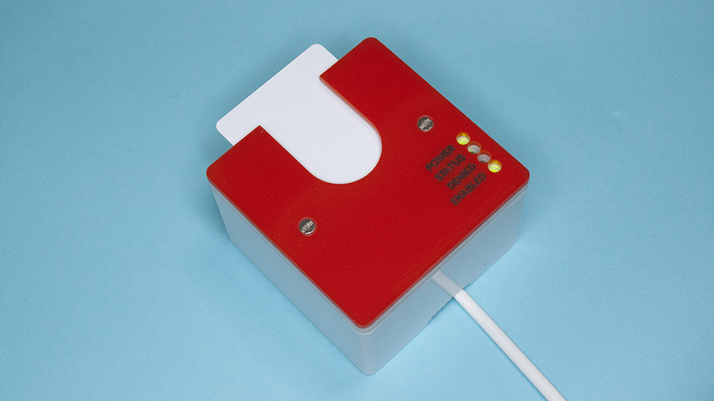
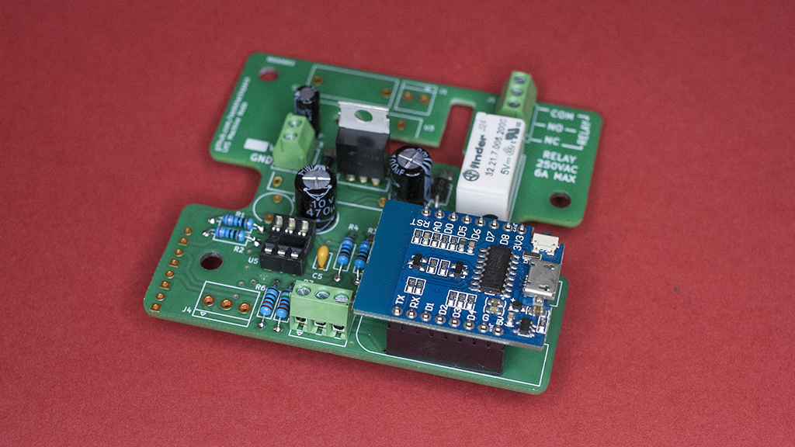
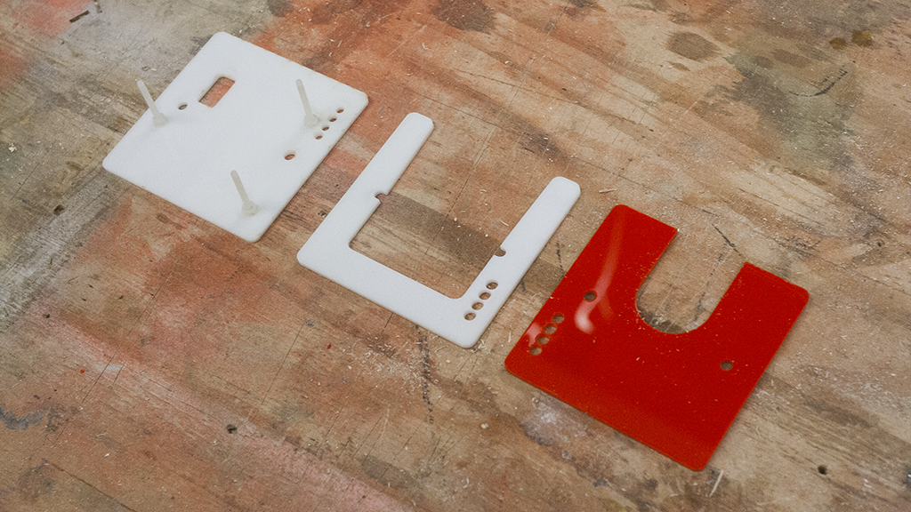

# Machine Node (WiFi)

Hardware and firmware to provide restricted access to dangerous and delicate
tools. Built around an ESP8266 (WeMos D1 mini) and RFID-RC522 breakout.

Designed to be easy to build for all levels of experience - simply order the PCB
from DirtyPCBs or OSHPark and solder the through hole parts to the board.
Software builds through the Arduino environment and will flash directly to the
WeMos board over USB.

## Hardware

To build a machine node you simply need to acquire a PCB - gerbers are available
in the hardware folder - and order the parts listed in the BOM.

[Schematic](hardware/images/schematic-rev1.png).

### Power Supply Options

There are three power supply options.

* **12 V DC Power**  
  This is the recommended option. Populate the 12 V DC section of the schematic, and also `C4` if you wish.
* **5 V DC Power** (Untested)  
  Populate the 12 V DC section of the schematic, and do not fit `U2` or `D2`. Use a jumper wire to bridge `D2` and connect the solder jumper `JP1`.  
  There is no polarity protection in this configuration.
* **240 AC Mains Power** (Untested)  
  Populate the 240 V AC section of the schematic. There is a PTC fuse inside the AC-DC power supply `U3` but there should be external fusing as well to protect small gauge cabling coming into the terminals.

### Relay Contacts

The relay is rated for 250 V, 6 A max. If you are switching heavy loads it is recommended that you use this to trip an external contactor.

### Latch Mode

The default state is "Present" mode, that is, the output will turn on when the card
is present and it will turn off when it is removed. An as yet untested mode allows the
node to read a card once and then keep the output enabled until an external signal is
received.

Feel free to test this mode out, you can modify settings in `settings.h`. Remember to include a button to allow the user to cancel their session.

### Faceplate

Enclosure parts are for laser cutting and will fit a [deep surface mount
pattress box](https://www.screwfix.com/p/lap-1-gang-surface-pattress-box-w-cable-clamp-earth-terminal-white-46mm/28489) available from LAP. You need to countersink the "solid" back plate
and fit screws through into the backbox compartment to secure the PCB in place.
Nylon screws & nuts are recommended to secure the PCB to minimize any interference
with the RFID signal. Typical metal faceplate screws are acceptable to attach
the faceplate to the backbox.

## Software

### Library Requirements
* [MFRC522 RFID](https://github.com/miguelbalboa/rfid)
* [ArduinoJson](https://arduinojson.org/)
* [ESP8266RestClient](https://github.com/fabianofranca/ESP8266RestClient)

Modify `settings-example.h` and rename as `settings.h`.

Requires the [Tool API server](https://github.com/leedshackspace/tool-api) running somewhere accessible, at least until the cards have been cached.
